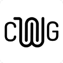

# Welcome - MCP Community Working Groups

<!--  -->

Welcome to the MCP Community Working Group Repository.

<!-- [TODO - add friendlier welcome text] -->

> [!NOTE]
> This repository is for Community Working Group Collaboration. Questions and Discussions on the MCP should be conducted in the appropriate [Model Context Protocol](https://github.com/modelcontextprotocol) repository.

## Getting Started

1. Read below for information about how the Working Groups operate.
2. Join us on the [Discord](https://discord.gg/RkqKnmrp) chat.
3. Send a request to join either on Discord or by raising an [Issue](https://github.com/evalstate/mcp-community-group/issues) here, and begin contributing.

All content added to this repository is contributed under the MIT License.

If you are unsure if you are able to include content under that license, please contact one of the group administrators for advice.

## Working Groups

Working Groups normally have 2 complimentary goals:

1. To share common practices for implementing solutions with the MCP.
1. To propose changes to the MCP Specification that benefit the wider community.

> [!IMPORTANT]
> All working group members must adhere to the MCP [Code of Conduct](https://github.com/modelcontextprotocol/modelcontextprotocol/blob/main/CODE_OF_CONDUCT.md)

### Current Working Groups

- **Hosting**: ([wg/host](wg/host)) Exploring deployment, scaling, and infrastructure considerations
- **Agents**: Focused on interaction patterns between agents using MCP
- **Authorization**: Addressing security and access control within MCP implementations
- **Search, Tools, Emerging Topics** ([wg/misc]) Focussed discussions on Protocol ideas and changes .

## Taxonomy

MCP serves as an enabler for innovative LLM application development, providing interoperability without being prescriptive about application design. The protocol consists of four main components:

1. The [specification](https://modelcontextprotocol.io/specification/2025-03-26), defining the Protocol and Transports.
2. [Reference SDKs](https://modelcontextprotocol.io/sdk/java/mcp-overview) that implement the Protocol and Transports to help developers build interoperable solutions.
3. Supporting resources such as User Guides, Tutorials, Debugging Tools and Reference Applications.
4. Working Group artefacts - implementation patterns, configuration guides, and other community-developed resources.

Each component serves a different purpose:

- The specification provides the foundational interoperability layer
- Reference SDKs bridge the specification to language-specific implementations
- Supporting resources facilitate adoption and implementation
- Working Group artefacts enable experimentation and innovation

This layered approach allows MCP to provide standardization where needed while encouraging innovation and flexibility in application design. Working Groups play a crucial role in balancing these priorities, contributing to all layers while respecting their different purposes and impact scopes.

### Specification Changes

The barrier for specification changes is intentionally high due to the cascading impact on implementers. Changes should be:

1. **Well-justified**: Addressing a genuine gap or limitation that impacts the feasibility, viability or sustainability of deployments.
2. **Practice-proven**: Demonstrated in real implementations before formalization
3. **Widely beneficial**: Serving the broader community, not just specific vendors

> **Cascading Impact Principle**: Changes at higher layers in the MCP hierarchy necessitate corresponding updates in lower layers. This cascading effect is why there are different barriers to change - the higher in the stack, the more widespread the impact.

### When to Update Different Artifacts

| Artifact Type                                      | When to Update                                                                                                                                                    | Barrier to Change                                                                                               |
| -------------------------------------------------- | ----------------------------------------------------------------------------------------------------------------------------------------------------------------- | --------------------------------------------------------------------------------------------------------------- |
| **Specification**                                  | Only when necessary to enable core functionality or address critical limitations that impact the feasibility or viability of implementations across the ecosystem | High - requires demonstrated community need and proven implementation examples                                  |
| **Reference SDKs - Specification Alignment**       | When necessary to maintain compliance with specification changes or to implement standardized patterns across all SDK languages                                   | High - requires strict adherence to the specification, interoperability testing and cross-SDK consistency       |
| **Reference SDKs - Language-Specific Innovations** | When implementing idiomatic patterns, optimizations, or extensions that improve developer experience within a specific language ecosystem                         | Medium - requires demonstrated utility within the language community while maintaining specification compliance |
| **Supporting Resources**                           | To improve onboarding experience, clarify implementation guidance, or document new patterns that emerge from the community                                        | Medium - requires validation from multiple implementers                                                         |
| **Working Group Artefacts**                        | To share emerging patterns, experimental approaches, and implementation guidance that may eventually influence higher layers                                      | Low - encourages innovation and collaboration                                                                   |

Working Groups should assess whether a proposed change is best suited as:

- A specification change (highest impact, highest barrier)
- A Reference SDK specification alignment change (high impact, high barrier)
- A Reference SDK language-specific innovation (high impact, medium barrier)
- A Supporting Resource update (medium impact, medium barrier)
- Working Group artefact (lowest impact, lowest barrier)

Working groups should favor evolutionary improvement through:

- Establishing patterns in Working Group artefacts first
- Implementing and testing approaches before updating Supporting Resources
- Promoting to Reference SDKs as language-specific innovations after demonstrated value within a language ecosystem
- Standardizing successful language-specific innovations across all Reference SDKs when proven valuable in multiple contexts
- Inclusion in the specification only when proven essential for ecosystem interoperability

### Decision Making

Working groups should aim for consensus-driven decisions:

- Manage by objection rather than requiring unanimous enthusiasm
- "Yes, and..." approaches over "No, but..." resistance
- Experimentation is preferred over speculation: demonstrate capabilities rather than debate theoretical approaches
- Clearly identify goals for topic areas (e.g. is the aim to agree common patterns, or change the spec?)

## Working Group Conduct

Working Groups have open membership, and often span multiple topics. We want to make sure that all who wish to contribute have the right forums and opportunities to do so.

The ground rules are intended to facilitate this without being too formal.

### Topic Areas

Working Groups typically cover a range of related topics. For example, the "Hosting" group may examine "Multi-Tenancy," "Transport Configuration," "Scaling Patterns," and more.

Topic areas naturally develop different characteristics based on community needs and participant expertise:

- **Varying Structure**: Some Topic Areas may choose more formal processes to meet industry deadlines or compliance requirements, while others thrive with exploratory approaches and proof-of-concept experimentation.

- **Community-Driven Priorities**: The urgency, depth, and focus given to each topic reflects the interests and contributions of active participants.

This diversity of approaches enables the community to address both immediate implementation challenges and longer-term protocol evolution simultaneously.

#### Examples:

| Topic Area                          | Typical Approach                                           | Community Focus                                                  |
| ----------------------------------- | ---------------------------------------------------------- | ---------------------------------------------------------------- |
| Agent Interaction Patterns          | Exploratory research with proof-of-concept implementations | Understanding emerging patterns before standardization           |
| Regulatory Compliance Requirements  | Structured development with defined milestones             | Meeting industry deadlines while ensuring protocol compatibility |
| Container Deployment Configurations | Collaborative documentation of tested implementations      | Sharing practical hosting solutions across environments          |

### Process vs Content

Working Group activities are separated into two distinct types of discussions:

**Process Meetings** focus on coordination, planning, and governance:

- Each Working Group has a coordination meeting about **_how_** the group operates
- [Topic Facilitators](#the-ideal-topic-facilitator) are identified based on community interest and expertise
- We agree Working Group Topics, and coordinate if necessary with other working groups.

**Content Meetings** focus on the technical substance:

- Content meetings explore **_what_** the group is working on
- Detailed technical discussions should happen in Content meetings, this repository or discord.
- Dedicated time for subject matter experts to contribute

| Process Example                                                     | Content Example                                                  |
| ------------------------------------------------------------------- | ---------------------------------------------------------------- |
| Scheduling technical deep-dive sessions with subject matter experts | Developing best practices for securing transport connections     |
| Establishing guidelines for reviewing working group artifacts       | Creating reference configurations for cloud hosting environments |
| Coordinating the roadmap for specification change proposals         | Designing patterns for error handling across transport types     |
| Agreeing timelines and expected outputs for the working group       | Evaluating proposed protocol extensions with proof-of-concept    |

Each topic area should nominate a [_Facilitator_](#the-ideal-topic-facilitator) to help arrange necessary meetings and coordinate group discussions. Facilitators ensure that:

- Meetings have clear agendas
- Technical discussions have dedicated space
- Decision-making remains transparent
- Experimentation is prioritized over speculation

### Interests vs Positions

Working groups are more productive when members focus on interests rather than positions. This distinction comes from principled negotiation techniques:

- **Positions** are fixed demands or solutions that people advocate for
- **Interests** are the underlying needs, concerns, or goals that drive positions

| Position (Less Helpful)                                                      | Interest (More Helpful)                                                               |
| ---------------------------------------------------------------------------- | ------------------------------------------------------------------------------------- |
| "We must implement vendor X's authentication protocol in the specification"  | "We need a secure authentication method that works well with our existing systems"    |
| "The specification should mandate encrypted communication channels"          | "We need to ensure data privacy for regulated industries"                             |
| "Transport Y is the only acceptable solution for high-performance scenarios" | "We need transport options that can handle high-throughput, low-latency requirements" |
| "The MCP SDK must support language Z"                                        | "Our development team needs accessible tooling that works with our technology stack"  |

When discussions focus on interests:

- More creative solutions emerge
- Multiple interests can often be satisfied simultaneously
- The real priorities become transparent
- Collaboration improves as participants understand each other's needs

> Example: Instead of arguing "We must implement AWS-specific authentication", share "Our organization has invested heavily in AWS IAM and need compatible authentication options." This reveals the actual need without prescribing a single solution.

### Sharing vs Marketing

Working groups benefit from open sharing of expertise and experience, but should avoid promotional marketing:

✅ **Acceptable Sharing**:

- "Our team implemented pattern X and found these specific challenges..."
- "We've tested three approaches to solve problem Y, and approach Z worked best because..."
- "Here's a demonstration of our implementation that addresses the multi-tenancy issue"

❌ **Unacceptable Marketing**:

- "Our company's proprietary solution is the best way to solve this problem"
- "Our product reduces MCP implementation costs by 50% - contact us for pricing"
- Using working group forums primarily to gain visibility for commercial offerings

Multiple voices from a single entity have less weight than single voices from multiple entities.

> Example: A large team from _Galactic Hosting Corporation_ joining a working group meeting to advocate a specific position, leaving no room for others to speak.

### Participation and Contributions

Working groups enable diverse participation through multiple contribution channels:

- Working group artefacts are stored within this repository.
- Members are expected to contribute to these repositories asynchronously, allowing for participation regardless of time zone or availability for meetings
- For synchronous meetings (videoconference or in-person), facilitators commit to present written representations from those who cannot attend (assuming agreement in advance due to circumstances). This practice respects different timezones and circumstances, and is offered as a collaborative courtesy rather than a formal service.
- The community [Discord](https://discord.gg/RkqKnmrp) offers a fast way to ask questions, or discuss topic items in real-time.

## The Ideal Facilitator

### The Ideal Topic Facilitator

- Has time to dedicate to summarizing and organizing information, welcoming new members, and guiding contributors to the topic area.
- Uses techniques to maintain fair participation and encourage group progress (e.g., focus Interests vs. Positions, balancing Inquiry/Advocacy, Decision Making techniques).
- Balance personal investment with fair guidance: If you have strong views on a particular outcome, consider how you'll maintain neutrality while facilitating group discussions.

If this sounds like you—or something you'd like to try—get in touch!

---

[^1]: Working Groups maintain public documentation areas linked from the modelcontextprotocol.io site to share implementation patterns and guides.
