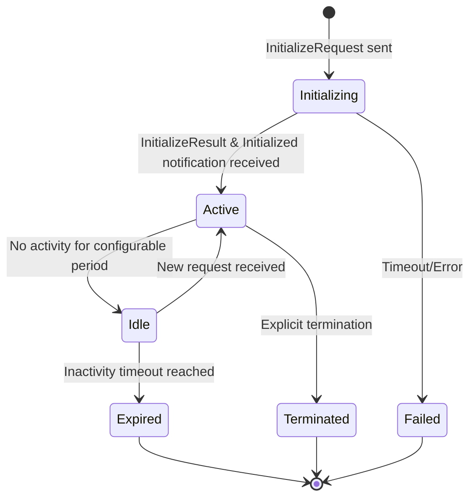
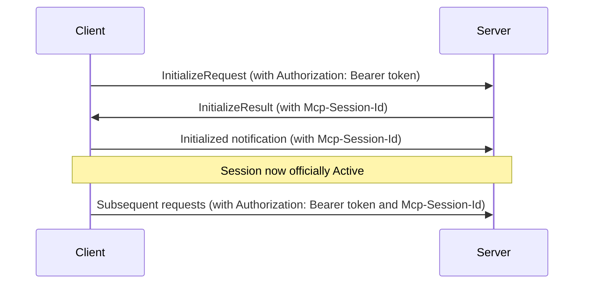
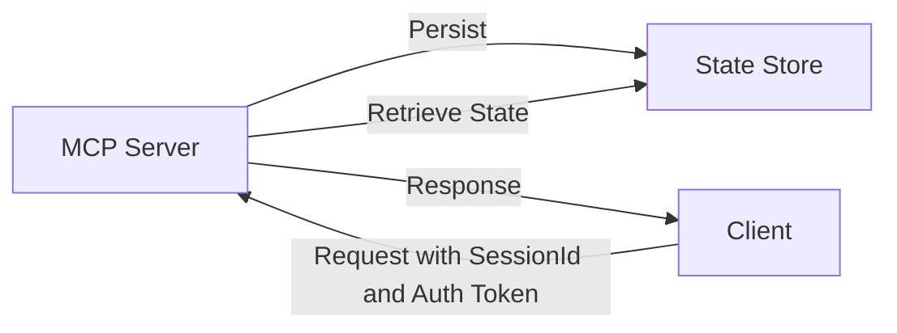

# Standardize session management for stateful remote MCPs

## TL;DR
This RFC proposes standardized approaches to session management for MCPs, addressing issues like session timeouts, recovery, and data privacy. It aims to make stateful MCPs work consistently across different hosting environments.

## Problem

Today's MCP specification has basic session management, but it's missing several important pieces:

1. **Unclear session lifecycle** - When exactly is a session "established"?
2. **No standard timeout policies** - How long **SHOULD** we wait during initialization or inactivity?
3. **Missing recovery mechanisms** - What happens when connections drop?
4. **Inconsistent state management** - Different cloud providers handle state differently
5. **No agreed-upon best practices** - How long **SHOULD** sessions last? When **SHOULD** we renew them?
6. **Vague user consent approach** - How do we properly handle privacy for session data?

These gaps make it hard to deploy stateful MCPs consistently, especially when different environments handle state management differently.

## Solution

This RFC proposes a comprehensive approach to session management that builds on the existing MCP specification.

### 1. Session Lifecycle Definition

Here's a clear model of how sessions work from start to finish, extending the existing MCP lifecycle (Initialization, Operation, Shutdown):



### 2. Session Establishment Protocol with Streamable HTTP Transport

Following the HTTP transport mechanism in the MCP specification, here's how sessions are created:



For HTTP transport, sessions **MUST** follow these rules:

1. Session IDs **MUST** only use visible ASCII characters (printable characters between 0x21 and 0x7E)
2. Clients **MUST** include the `Mcp-Session-Id` header in all requests after getting it from the server
3. Clients **SHOULD** send an HTTP DELETE to properly end sessions when done
4. Servers **MUST** respond with HTTP 404 if a request uses a terminated session ID
5. Servers **MAY** respond with HTTP 405 if they don't allow clients to terminate sessions via DELETE

### 3. Session Management API

Here's a standard API for managing sessions:

```typescript
interface SessionManager {
  // Create or retrieve a session
  getSession(sessionId?: string, authToken: string): Promise<Session>;
  
  // Explicit session termination
  terminateSession(sessionId: string, authToken: string): Promise<void>;
  
  // Session renewal/keepalive
  renewSession(sessionId: string, authToken: string): Promise<void>;
  
  // Check session validity
  isSessionValid(sessionId: string, authToken: string): Promise<boolean>;
  
  // Record user consent for session data usage
  recordUserConsent(sessionId: string, consentScope: string[]): Promise<void>;
  
  // Verify user has given consent for specific operation
  hasUserConsent(sessionId: string, operation: string): Promise<boolean>;
}

interface Session {
  id: string;
  created: Date;
  lastActive: Date;
  state: 'initializing' | 'active' | 'idle' | 'expired' | 'terminated';
  metadata: Record<string, any>; // Optional client/server-specific data
  userConsent: {
    consentProvided: boolean;
    consentScopes: string[];
    consentTimestamp?: Date;
  };
}
```

### 4. Timeout Policies

We need clear rules for timeouts:

- **Initialization Timeout**: Servers **MUST** implement a configurable timeout for session initialization (default: 30 seconds). If the server doesn't receive the `Initialized` notification within this timeframe, the session is considered failed.

- **Inactivity Timeout**: Servers **SHOULD** implement configurable inactivity timeouts (suggested defaults: mark as idle after 5 minutes, expire after 10 minutes of no activity).

- **Session Renewal**: Servers **MUST** support a way to explicitly extend session validity (keepalive).

### 5. State Persistence Requirements

When cloud providers manage state for MCP deployments, they **MUST**:



- Implement atomic state operations (all-or-nothing changes)
- Support session recovery after server restarts
- Provide isolation between different sessions
- Include TTL (Time To Live) mechanisms for automatic cleanup
- Enforce appropriate access controls based on authentication
- Never persist user data without explicit consent

### 6. Recovery Mechanisms

Things go wrong. Here's how to handle that:

- **Session Restoration**: Servers **SHOULD** be able to restore sessions after unexpected disconnections
- **State Snapshots**: Servers **SHOULD** regularly save session state
- **Graceful Degradation**: Servers **MUST** have clear policies for handling partial state loss

### 7. Security Considerations

#### 7.1 User Consent and Control

Respecting user data and privacy:

- Servers **MUST** get explicit user consent before storing any user data
- Clients **MUST** provide clear explanations of what data will be stored and why
- Servers **MUST** respect the scope of consent provided
- Users **MUST** be able to revoke consent and end sessions at any time

#### 7.2 Authentication and Authorization

Keeping sessions secure:

- Session IDs **MUST** be cryptographically secure (UUID v4 or stronger)
- All endpoints **MUST** use HTTPS
- All requests **MUST** include proper authorization following OAuth 2.1
- Access tokens **MUST** be validated properly
- Invalid tokens get HTTP 401 responses
- Servers **MUST** never include access tokens in URI query strings
- Servers **SHOULD** implement authorization metadata discovery
- Implementors **SHOULD** consider dynamic client registration support

#### 7.3 Session Security

Additional security measures:

- Servers **MUST** limit how quickly new sessions can be created (rate limiting)
- Servers **MUST** apply principle of least privilege
- Servers **SHOULD** consider token rotation for long-lived sessions
- Servers **MUST** protect session data from unauthorized access
- Session IDs **MUST** not be predictable or reused
- Clients **MUST** securely store tokens

#### 7.4 Error Handling

Proper error handling:

- Authentication errors **MUST** return appropriate HTTP status codes
- Session not found errors **MUST** return HTTP 404
- Error responses **MUST** follow OAuth 2.1 error format
- Error messages **MUST** not leak sensitive information
- Servers **SHOULD** log security events
- Clients **MUST** handle authentication and session errors appropriately

### 8. Implementation Examples

#### Server Implementation

```typescript
class MCPServer {
  private sessionManager: SessionManager;
  
  async handleInitialize(request: InitializeRequest): Promise<InitializeResult> {
    // Extract authorization token from request headers
    const authToken = request.headers['Authorization'].replace('Bearer ', '');
    if (!authToken) {
      // Return 401 status code per MCP Section 2.6.2
      throw new ErrorResponse(401, {
        error: 'invalid_token',
        error_description: 'Authorization token required'
      });
    }
    
    // Validate the token as required by MCP Section 2.6.2
    if (!await this.validateToken(authToken)) {
      throw new ErrorResponse(401, {
        error: 'invalid_token',
        error_description: 'Token validation failed'
      });
    }
    
    // Create session only after obtaining user consent
    if (!request.params.userConsent) {
      throw new ErrorResponse(403, {
        error: 'consent_required',
        error_description: 'User consent required to create session'
      });
    }
    
    const session = await this.sessionManager.getSession(undefined, authToken);
    await this.sessionManager.recordUserConsent(session.id, request.params.userConsent);
    
    const result = { /* initialize result */ };
    
    // Add session ID to response headers
    response.headers['Mcp-Session-Id'] = session.id;
    
    // Send initialized notification after capabilities are ready
    setTimeout(() => this.sendInitializedNotification(session.id), 0);
    
    return result;
  }
  
  async handleRequest(request: any, sessionId: string): Promise<any> {
    // Extract authorization token from request headers
    const authToken = request.headers['Authorization'].replace('Bearer ', '');
    if (!authToken) {
      throw new ErrorResponse(401, {
        error: 'invalid_token',
        error_description: 'Authorization token required'
      });
    }
    
    // Validate token according to MCP Section 2.6.2
    if (!await this.validateToken(authToken)) {
      throw new ErrorResponse(401, {
        error: 'invalid_token',
        error_description: 'Token validation failed'
      });
    }
    
    if (!await this.sessionManager.isSessionValid(sessionId, authToken)) {
      throw new ErrorResponse(404, {
        error: 'invalid_session',
        error_description: 'Session not found or expired'
      });
    }
    
    // Check for user consent if operation requires it
    const operation = request.method;
    if (!await this.sessionManager.hasUserConsent(sessionId, operation)) {
      throw new ErrorResponse(403, {
        error: 'consent_required',
        error_description: `User consent required for operation: ${operation}`
      });
    }
    
    // Process request and return response
    await this.sessionManager.renewSession(sessionId, authToken);
    return { /* response */ };
  }
  
  // Handle explicit session termination via HTTP DELETE
  async handleSessionTermination(sessionId: string, authToken: string): Promise<void> {
    try {
      await this.sessionManager.terminateSession(sessionId, authToken);
      // Return 200 OK to indicate successful termination
    } catch (error) {
      // If server doesn't allow client-initiated termination, return 405
      throw new ErrorResponse(405, {
        error: 'method_not_allowed',
        error_description: 'Session termination not allowed'
      });
    }
  }
  
  // Token validation as required by MCP Section 2.6.2
  private async validateToken(token: string): Promise<boolean> {
    // Implementation **SHOULD** validate the token according to OAuth 2.1 requirements
    // including checking signature, expiration, scope, etc.
    return true; // Placeholder
  }
}

// Standard error response format
class ErrorResponse extends Error {
  constructor(public status: number, public body: {
    error: string,
    error_description: string,
    error_uri?: string
  }) {
    super(body.error_description);
  }
}
```

#### Client Implementation

```typescript
class MCPClient {
  private sessionId: string | null = null;
  private authToken: string | null = null;
  private tokenStorage: TokenStorage; // Secure token storage implementation
  
  constructor(private tokenStorage: TokenStorage) {
    this.tokenStorage = tokenStorage;
  }
  
  async initialize(authOptions: {
    userConsent: string[],
    interactive?: boolean
  }): Promise<void> {
    // Retrieve token from secure storage
    this.authToken = await this.tokenStorage.getToken();
    
    if (!this.authToken) {
      // If no token exists or interactive mode enabled, perform authorization
      if (authOptions.interactive) {
        this.authToken = await this.performAuthorization();
        await this.tokenStorage.saveToken(this.authToken);
      } else {
        throw new Error('No authorization token available and interactive mode disabled');
      }
    }
    
    const response = await this.sendRequest({
      method: 'initialize',
      params: {
        userConsent: authOptions.userConsent
      },
      headers: {
        'Authorization': `Bearer ${this.authToken}`
      }
    });
    
    this.sessionId = response.headers['Mcp-Session-Id'];
    
    // Wait for initialized notification as required by MCP lifecycle
    await this.waitForInitialized(30000); // 30 second timeout
  }
  
  async sendRequest(request: any): Promise<any> {
    if (this.sessionId && request.method !== 'initialize') {
      request.headers = {
        ...request.headers,
        'Mcp-Session-Id': this.sessionId,
        'Authorization': `Bearer ${this.authToken}`
      };
    }
    
    try {
      return await this.transport.send(request);
    } catch (error) {
      if (error.status === 401) {
        // Token expired, get new token and retry
        this.authToken = await this.refreshToken();
        await this.tokenStorage.saveToken(this.authToken);
        return this.sendRequest(request);
      } else if (error.status === 404) {
        // Session expired, reinitialize
        this.sessionId = null;
        await this.initialize({ userConsent: ['basic'] });
        return this.sendRequest(request);
      } else if (error.status === 403 && error.body?.error === 'consent_required') {
        // Handle consent requirement
        const consents = await this.requestUserConsent(error.body.error_description);
        request.params = {
          ...request.params,
          userConsent: consents
        };
        return this.sendRequest(request);
      }
      throw error;
    }
  }
  
  // Explicitly terminate the session when no longer needed
  async terminateSession(): Promise<void> {
    if (this.sessionId) {
      try {
        // Send HTTP DELETE to terminate the session as specified in MCP transport spec
        await this.transport.delete({
          headers: {
            'Mcp-Session-Id': this.sessionId,
            'Authorization': `Bearer ${this.authToken}`
          }
        });
      } catch (error) {
        // Handle 405 Method Not Allowed if server doesn't support client termination
        if (error.status !== 405) {
          throw error;
        }
      }
      this.sessionId = null;
    }
  }
  
  // Secure token handling according to OAuth best practices
  private async refreshToken(): Promise<string> {
    // Implementation **SHOULD** handle token refresh according to OAuth 2.1
    return "new_token"; // Placeholder
  }
  
  // Request user consent through appropriate UI
  private async requestUserConsent(description: string): Promise<string[]> {
    // Implementation **SHOULD** display a modal or UI element to request specific consent
    // and return the scopes the user has agreed to
    return new Promise((resolve) => {
      // In a real implementation, this would show a UI element explaining what
      // data will be stored and for what purpose, then collect user choices
      const consentUI = this.createConsentInterface(description);
      consentUI.onAccept = (selectedScopes) => {
        resolve(selectedScopes);
      };
      consentUI.onReject = () => {
        resolve([]);
      };
      consentUI.show();
    });
  }
  
  private createConsentInterface(description: string): ConsentInterface {
    // Create and return appropriate consent UI based on client environment
    // Could be a modal dialog in web contexts, a native popup in desktop apps, etc.
    return new ConsentInterface(description, ['basic', 'profile', 'history', 'preferences']);
  }
}

// Secure token storage interface
interface TokenStorage {
  saveToken(token: string): Promise<void>;
  getToken(): Promise<string | null>;
  clearToken(): Promise<void>;
}
```

### 9. Best Practices

#### Session Duration

How long **SHOULD** sessions last?

- **Quick interactions**: 10-15 minutes for single user interactions
- **Ongoing work**: 1-24 hours with renewal for persistent work sessions
- **Long-term sessions**: **MUST** have explicit renewal mechanisms

#### State Management

How to properly manage state:

- Segment state by user/tenant
- Isolate sessions from each other
- Consider how to migrate state during upgrades

#### Monitoring

What to watch for:

- Track session creation/termination rates
- Monitor how long sessions typically last
- Watch for unusual patterns that might indicate abuse
- Log security events
- Track authentication failures to spot potential attacks

#### Authorization Best Practices

Security recommendations:

- Implement authorization metadata discovery
- Support dynamic client registration
- Use PKCE for authorization code flows
- Enforce token expiration and rotation
- Follow best practices for local clients

### 10. Provider-Agnostic State Management API

A consistent API for state storage that works across different environments:

```typescript
interface StateStore {
  // Store session data with optional TTL
  set(key: string, value: any, ttlSeconds?: number): Promise<void>;
  
  // Retrieve session data
  get(key: string): Promise<any | null>;
  
  // Delete session data
  delete(key: string): Promise<void>;
  
  // Check if session exists
  exists(key: string): Promise<boolean>;
  
  // Update session TTL
  updateTTL(key: string, ttlSeconds: number): Promise<boolean>;
  
  // Atomic operations
  compareAndSet(key: string, expectedValue: any, newValue: any): Promise<boolean>;
}
```

This abstraction **MUST** be implemented regardless of whether you're using cloud services, self-hosted databases, or in-memory solutions. This ensures MCP implementations work consistently across different environments.

### 11. User Data Privacy

Protecting user data:

- Get explicit consent before storing user data
- Don't transmit resource data elsewhere without permission
- Protect user data with appropriate access controls
- Clearly document what data is stored, for how long, and why
- Provide ways for users to view and delete their stored data
- Implement proper data isolation to prevent unauthorized access


## FAQ

### When is a session officially initialized?
A session is officially active only after both steps are complete: the client receives the InitializeResult AND the server receives the Initialized notification. Both steps **MUST** happen for a session to be considered active.

### What happens if initialization isn't completed?
If the Initialized notification never arrives after the server sends InitializeResult, the client **SHOULD** abort after waiting for the initialization timeout (default 30 seconds) and try to initialize again.

### How long should sessions last?
We recommend a default of 10 minutes of inactivity before expiring a session, but this **SHOULD** be configurable based on your specific use case. For longer interactions, implement explicit renewal mechanisms.

### How should user consent be handled?
Servers **MUST** implement a way to get and record user consent for session data storage and processing. Consent **SHOULD** be specific to exactly what operations will be performed with the data.

### How should tokens be handled?
All token validation and handling **MUST** follow OAuth 2.1 requirements as specified in the MCP spec.

### How should sessions be terminated?
Clients **SHOULD** send an HTTP DELETE to the MCP endpoint with the `Mcp-Session-Id` header to properly end sessions. Servers **MUST** respond with HTTP 404 to requests that use terminated session IDs.


